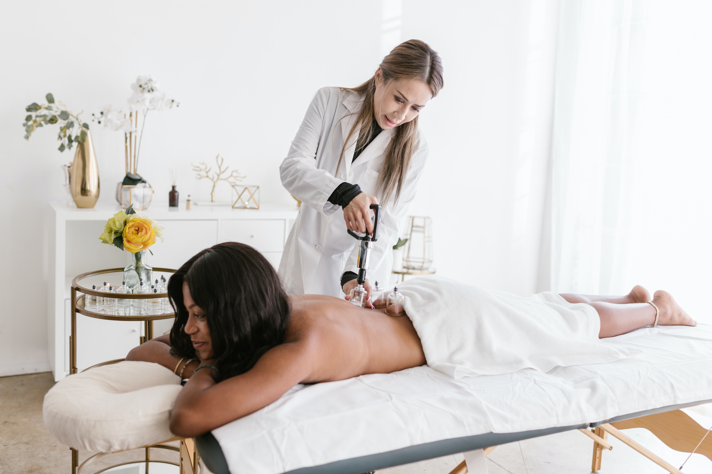
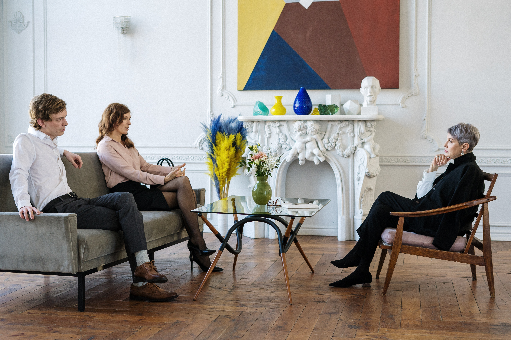

# Blessing Therapeutic Studio 🌟🌿

  

## Table of Contents
- [Description](#description)
- [About Us](#about-us)
- [Our Services](#our-services)
  - [Massage Therapy](#massage-therapy)
  - [Mindfulness Meditation](#mindfulness-meditation)
  - [Holistic Counseling](#holistic-counseling)
- [Contact Us](#contact-us)
- [Live Demo](#live-demo)
- [Features](#features)
- [Getting Started](#getting-started)
- [Manual Testing](#manual-testing)
- [Acknowledgements](#acknowledgements)
- [Footer](#footer)

## Description

Your journey to wellness starts here. 🌟

Welcome to Blessing Therapeutic Studio, where we believe in promoting holistic well-being through personalized therapeutic sessions. Our team of dedicated professionals is committed to helping you find inner balance, reduce stress, and achieve a healthier mind-body connection. With a focus on individual needs, our tranquil environment provides the perfect setting for your journey to wellness.

## About Us

Welcome to Blessing Therapeutic Studio!

At Blessing Therapeutic Studio, we are dedicated to providing you with the best therapeutic experience. Our services are designed to alleviate tension, reduce muscle stiffness, and promote overall relaxation. Whether you seek relief from chronic pain or simply want to unwind, our tailored massage sessions and mindfulness meditation classes are designed to meet your unique needs.

## Our Services

### Massage Therapy 🌸

Our skilled massage therapists offer a range of massage techniques to alleviate tension, reduce muscle stiffness, and promote overall relaxation. Whether you seek relief from chronic pain or simply want to unwind, our tailored massage sessions are designed to meet your unique needs.

### Mindfulness Meditation 🧘‍♀️

Experience the transformative power of mindfulness meditation at Blessing Therapeutic Studio. Our guided meditation sessions help you cultivate mindfulness, reduce stress, and enhance mental clarity. Embrace a calmer, more centered state of being through regular practice.

### Holistic Counseling 🌈

Our holistic counseling services provide a supportive space to address emotional challenges and foster personal growth. Our skilled counselors work with you to explore your inner landscape and develop coping strategies, empowering you to lead a fulfilling life.

## Contact Us

For inquiries or appointments, please feel free to reach out to us. We would love to hear from you!

### Contact Form

To get in touch, fill out the form below:

- **Name:** [Your Name]
- **Email:** [Your Email Address]
- **Message:** [Your Message]

[Submit]

## Live Demo

Check out the live demo of the Therapy Studio Website [here](https://princessble.github.io/Blessing-therapy-studio/).

## Features 🚀

- Personalized therapeutic sessions
- Guided mindfulness meditation
- Holistic counseling services
- Tranquil environment for wellness

## Getting Started

To get started with Blessing Therapeutic Studio, follow these steps:

1. Clone this repository.
2. Navigate to the project directory.
3. Open the `index.html` file in your web browser.

Thank you for visiting Blessing Therapeutic Studio's GitHub repository!

🌸 We are excited to share our passion for holistic well-being with you. If you have any questions, feel free to open an issue or contact us through our website.

💌 We hope to see you at our studio soon! 😊

## Manual Testing

Before deploying this website, I made sure to perform the following manual tests:

- **Navigation Links:**
  - [ ] About Us Link
  - [ ] Services link
  - [ ] Contact link

- **Forms:**
  - [ ] Contact form submission
  - [ ] User registration

- **Responsiveness:**
  - [ ] Test on various devices (desktop, tablet, mobile)
  - [ ] Test on different browsers (Chrome, Firefox, Microsoft Edge)

- **Images and Media:**
  - [ ] Verify that all images load correctly
  
- **Security:**
  - [ ] Test login functionality
  
- **Performance:**
  - [ ] Test page loading times

- **Browser Compatibility:**
  - [ ] Test on major browsers (Chrome, Firefox, Edge)

- **Error Handling:**
  - [ ] Test error messages and validation

- **Accessibility:**
  - [ ] Check for accessibility compliance

### Validation and Responsiveness

- **HTML Validation:**
  - [W3C HTML Validator](https://validator.w3.org/)
  
  
- **CSS Validation:**
  - [W3C CSS Validator](https://jigsaw.w3.org/css-validator/)
  
  
- **Responsive Design Checker:**
  - [Responsive Design Checker](https://www.responsivedesignchecker.com/)
  

Remember to mark each test case with `[ ]` when you perform the test and `[x]` when it passes.

If you encounter any issues during testing, please report them immediately for resolution.

## Acknowledgements 🙏

We express our sincere gratitude to the following tools and technologies that have played a crucial role in the creation of Blessing Therapeutic Studio's website:

1. HTML and CSS 🌐🎨: The backbone of web development, HTML, and CSS have been instrumental in structuring and styling our website, making it visually appealing and user-friendly.
2. Bootstrap 🅱️: We extend our appreciation to Bootstrap for providing a powerful and responsive framework that enabled us to create a modern and mobile-friendly design effortlessly.
3. Git and GitHub 🐙: We are grateful to Git and GitHub for their version control capabilities, making collaboration among our team members seamless and efficient.
4. Codeanyapp 💻: Our heartfelt thanks to Codeanyapp for serving as our trusty code editor, with its intuitive features and extensions that enhanced our productivity.
5. Font Awesome 🎉: We extend our appreciation to Font Awesome for its vast collection of icons that added visual appeal and clarity to our website.

We acknowledge the dedicated teams and communities behind these tools, whose continuous efforts have made web development an enjoyable and rewarding experience for us. Thank you for empowering us to create a website that truly reflects the essence of Blessing Therapeutic Studio. 🙏🌿

## Footer

&copy; 2023 Blessing Therapeutic Studio. All rights reserved. 🌟

---

For more information, visit our [website](https://princessble.github.io/Blessing-therapy-studio/) 🌐.